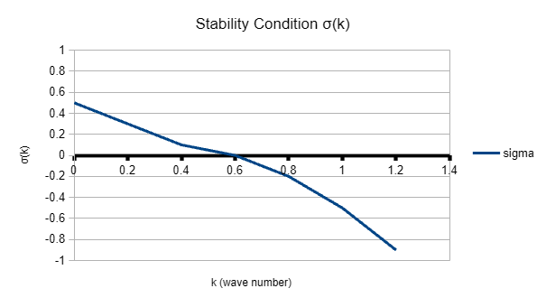
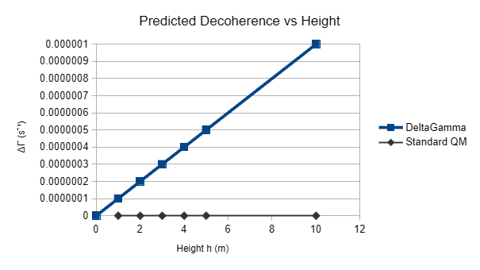

## Gravity-Dependent Decoherence:A Testable Model
An information-based framework connecting quantum mechanics, entropy, and gravity

## 📄 Paper

👉 **[Download v3 (latest)](./cell_update_gravity_model_v3.pdf)**

## Abstract

We propose a minimal theoretical framework in which reality emerges from stable information structures. By introducing internal degrees of freedom (χ) and entropy (θ), the model explains the transition from quantum coherence to classical behavior.

A key prediction is an additional gravity-dependent decoherence term:

ΔΓ = λgh / c²

This implies a linear dependence of decoherence on height, in contrast to standard quantum mechanics.

---

**Figure 1: Decoherence vs Height**  
Predicted linear dependence of decoherence ΔΓ on height (h) due to gravitational potential difference.

---

## Key Prediction

ΔΓ = λgh / c²

- Decoherence depends on gravitational potential  
- Not predicted by standard quantum mechanics  
- Direct experimental test possible  

---

## Theoretical Model: Stability Condition σ(k)

- Growth rate (σ(k)) vs wave number (k) is key to stability.

---

**Figure 2: Stability vs Wave Number**  
Shows the growth rate σ(k) and corresponding stability conditions in the model.

---

## Paper

- v1: Initial concept  
- v2: Extended model  
- v3: Stability + testable prediction ← latest  

---
